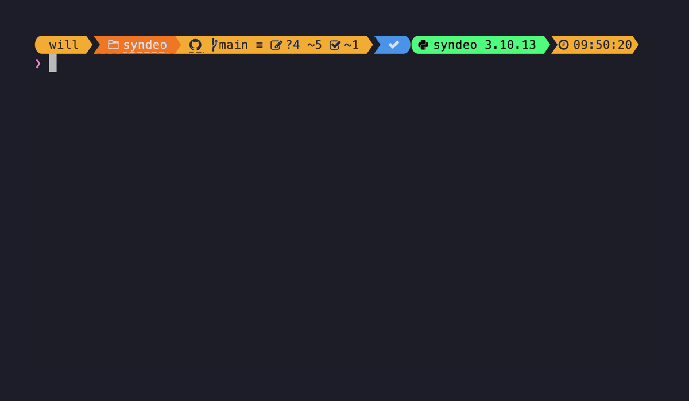

<p align="center">
  <a href="https://github.com/destin-v">
    
  </a>
</p>


# 📒 Description

<figure>
    <p align="center">
    
    </p>
</figure>

<p align="center">
  <a href="https://devguide.python.org/versions/">                  </a>
  <a href="https://github.com/pre-commit/pre-commit">               </a>
  <a href="https://docs.pytest.org/en/7.1.x/getting-started.html">  </a>
  <a href="https://black.readthedocs.io/en/stable/index.html">      </a>

</p>

<p align="center">
  <a href="https://github.com/mit-ll/Syndeo/actions/workflows/pre-commit.yml">  </a>
</p>

**Syndeo** allows developers to build portable **Ray Clusters** with **secure containerization**.  With Syndeo, developers can write their code using Ray and deploy it to on-premesis SLURM computing or off-premesis cloud computing without changing code.  Secure containerization means that user privileges are enforced and code deployed from Syndeo can operate on multi-tenant systems.

# 🛠️ Installation
These are some variables that should be set prior to running the tests.

```bash
# Ensure that you are using local python packages
export PYTHONNOUSERSITE=True
```

In order to run this program you will need to create a custom environment.  This assumes you are using Anaconda:

```bash
conda create -n syndeo python=3.10
conda activate syndeo
pip install poetry # should use versions >=1.4.2
poetry install # add --with=dev if you want developer tests
```

If you would rather use the pip installer executing the following instead:

```console
pip install .
```


# 📔 Usage
To see the CLI options enter:

```bash
python main.py --help
```
<figure>
    <p align="center">
    
    </p>
</figure>

<p align="center">
<b>Fig 1: CLI menu and options.</b>
</p>

To set up a Ray cluster with all defaults and run you can issue the following commands:

```bash
python main.py setup-head   # setup a node
python main.py setup-cpu    # setup a worker node
python main.py show         # show the configuration
python main.py run          # run the configuration
```

<figure>
    <p align="center">
    
    </p>
</figure>

If you need further help on the different commands you can invoke help via:

```bash
python main.py setup-head --help
```


If you want to have an alias with auto-completion invoke the following:
```bash
python main.py --install-completion
```

Afterwards you can invoke the commands using `syndeo`:
```bash
syndeo --help       # autocompletion included
syndeo setup_head   # autocompletion included
syndeo setup_cpu    # autocompletion included
```

# ✨ Acknowledgements
Special thanks to Chansup Byun, Albert Reuther, Rodney Lafuente Mercado, and Jaime Pena for helpful feedback and suggestions.

# 📚 References
* Pumperla, M., Oakes, E., & Liaw, R. (2023). Learning Ray. “O’Reilly Media, Inc.”
* Slurm Workload Manager - Documentation. (n.d.). https://slurm.schedmd.com/
* Cluster Management CLI — RAY 2.9.0. (n.d.). https://docs.ray.io/en/latest/cluster/cli.html#ray-start
* Deploying on Slurm — Ray 2.9.0. (n.d.). https://docs.ray.io/en/latest/cluster/vms/user-guides/community/slurm.html
* Ray Clusters Overview — Ray 2.9.0. (n.d.). https://docs.ray.io/en/latest/cluster/getting-started.html
* Scheduling — Ray 2.9.0. (n.d.). https://docs.ray.io/en/latest/ray-core/scheduling/index.html

# ♖ Distribution
DISTRIBUTION STATEMENT A. Approved for public release. Distribution is unlimited.

This material is based upon work supported by the Department of the Air Force under Air Force Contract No. FA8702-15-D-0001. Any opinions, findings, conclusions or recommendations expressed in this material are those of the author(s) and do not necessarily reflect the views of the Department of the Air Force.

© 2024 Massachusetts Institute of Technology.

The software/firmware is provided to you on an As-Is basis

Delivered to the U.S. Government with Unlimited Rights, as defined in DFARS Part 252.227-7013 or 7014 (Feb 2014). Notwithstanding any copyright notice, U.S. Government rights in this work are defined by DFARS 252.227-7013 or DFARS 252.227-7014 as detailed above. Use of this work other than as specifically authorized by the U.S. Government may violate any copyrights that exist in this work.
