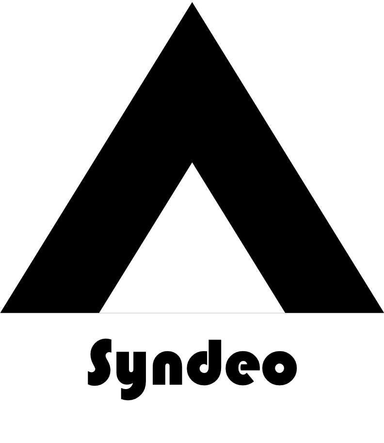

.. epigraph::
   “Syndeo (συνδέω) means to connect, link, or bind.

   --`Wiktionary <https://en.wiktionary.org/wiki/%CF%83%CF%85%CE%BD%CE%B4%CE%AD%CF%89>`_ ”

.. centered::
    |Li Productions|

.. centered::
    |Python Version| |Pre-Commit| |Pytest| |Sphinx| |Style| |Github|

#################
Table of Contents
#################
.. toctree::
   :maxdepth: 1
   :caption: Getting Started:

   pages/overview
   pages/installation
   pages/user_guide
   pages/development
   pages/benchmarks
   pages/pytest
   pages/troubleshooting

.. toctree::
   :maxdepth: 1
   :caption: References:

   pages/references
   pages/authors

##################
Indices and tables
##################

* :ref:`genindex`
* :ref:`modindex` [#]_
* :ref:`search`

..
   Backlinks and references

.. |Python Version|
    image:: https://img.shields.io/badge/python-^3.10-blue?logo=python&logoColor=white
    :target: https://devguide.python.org/versions/

.. |Pre-Commit|
    image:: https://img.shields.io/badge/pre--commit-enabled-blue?logo=pre-commit
    :target: https://github.com/pre-commit/pre-commit

.. |Github|
    image:: https://img.shields.io/badge/CI-github-blue?logo=github&logoColor=white
    :target: https://docs.github.com/en/actions/quickstart

.. |Pytest|
    image:: https://img.shields.io/badge/pytest-enabled-blue?logo=pytest&logoColor=white
    :target: https://docs.pytest.org/en/7.1.x/getting-started.html

.. |Sphinx|
    image:: https://img.shields.io/badge/Sphinx-book%20theme-blue?logo=sphinx&logoColor=white
    :target: https://sphinx-book-theme.readthedocs.io/en/stable/

.. |Style|
    image:: https://img.shields.io/badge/code%20style-black-blue
    :target: https://black.readthedocs.io/en/stable/index.html

..
    Images

.. |Li Productions|
    image:: https://raw.githubusercontent.com/destin-v/destin-v/main/docs/pics/logo.gif
    :width: 500
    :target: https://github.com/destin-v

..
   Footnotes
.. rubric:: Footnotes

.. [#] shows the structure and code of project
