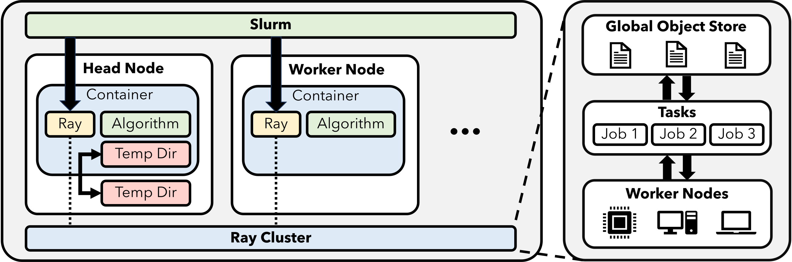

########
Overview
########

**Syndeo** allows developers to build portable **Ray Clusters** with **secure containerization**.  With Syndeo, developers can write their code using Ray and deploy it to on-premesis SLURM computing or off-premesis cloud computing without changing code.  Secure containerization means that user privileges are enforced and code deployed from Syndeo can operate on multi-tenant systems.

*******************
🐳 Containerization
*******************

.. raw:: html

    

        <iframe width="600" height="400" src="http://www.youtube.com/embed/J0NuOlA2xDc" frameborder="0" allowfullscreen></iframe>
    

Syndeo leverages containers to host Ray and all of your applications together.  These containers can then be deployed to SLURM or a cloud provider of your choosing.

Once the Ray Cluster is established, jobs can be directly sent to the Ray head node for processing.

************
Distribution
************

DISTRIBUTION STATEMENT A. Approved for public release. Distribution is unlimited.

This material is based upon work supported by the Department of the Air Force under Air Force Contract No. FA8702-15-D-0001. Any opinions, findings, conclusions or recommendations expressed in this material are those of the author(s) and do not necessarily reflect the views of the Department of the Air Force.

© 2024 Massachusetts Institute of Technology.

The software/firmware is provided to you on an As-Is basis

Delivered to the U.S. Government with Unlimited Rights, as defined in DFARS Part 252.227-7013 or 7014 (Feb 2014). Notwithstanding any copyright notice, U.S. Government rights in this work are defined by DFARS 252.227-7013 or DFARS 252.227-7014 as detailed above. Use of this work other than as specifically authorized by the U.S. Government may violate any copyrights that exist in this work.
