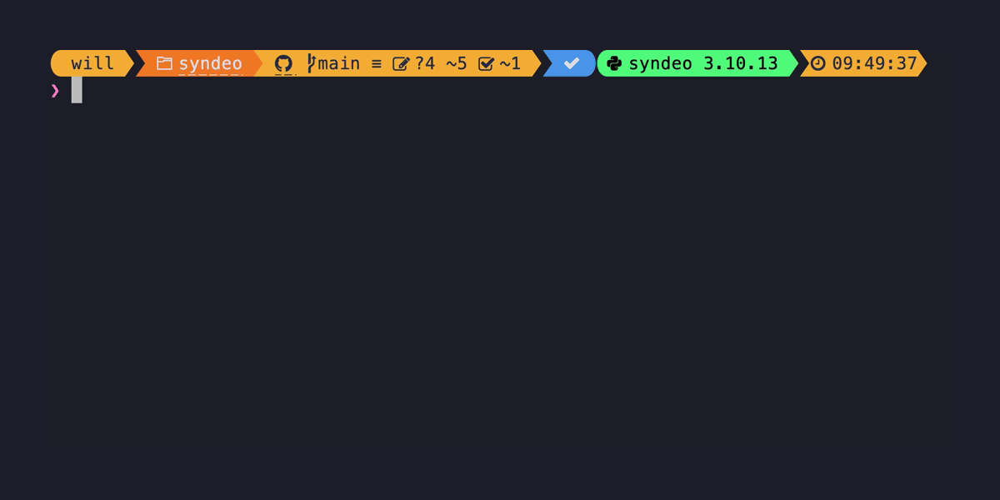
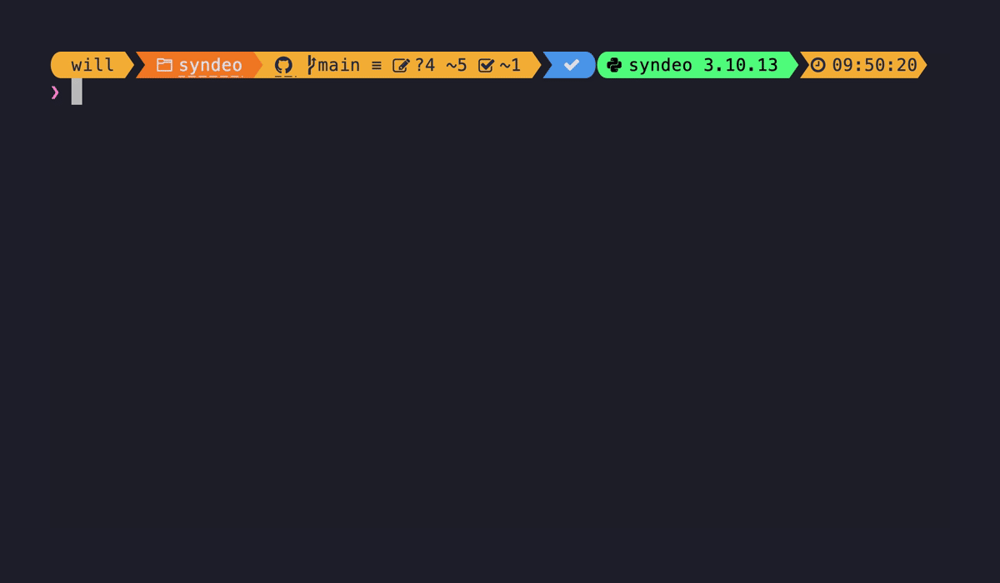
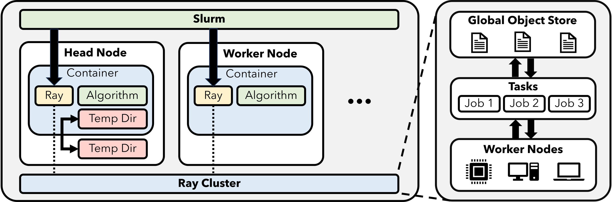

##########
User Guide
##########

#################
💡 Bare Metal Ray
#################
To see the CLI options enter:

.. code-block:: console

    python main.py --help

To setup a basic Ray Cluster enter:

To set up a Ray Cluster with all defaults you can issue the following commands:

.. code-block:: console

    python main.py setup-head   # setup a node
    python main.py setup-cpu    # setup a worker node
    python main.py show         # show the configuration
    python main.py run          # run the configuration

It will return the IP address of the Ray head node.  You should :code:`ssh` into Ray head node and execute the following test:

.. code-block:: python

    import socket
    import time
    from collections import Counter

    import ray

    @ray.remote
    def f() -> str:
        """Returns the IP address of the node."""
        time.sleep(0.001)
        # Return IP address.
        return socket.gethostbyname(socket.gethostname())

    def main(address: str):
        # Ray start
        context = ray.init(address=address)

        # Retrieve the IP addresses
        object_ids = [f.remote() for _ in range(10000)]
        ip_addresses = ray.get(object_ids)

        # Logging
        print("Tasks executed")
        for ip_address, num_tasks in Counter(ip_addresses).items():
            print("    {} tasks on {}".format(num_tasks, ip_address))

If you need further help on any command you can invoke help via:

.. code-block:: console

    python main.py setup-head --help

If you want to have an alias with auto-completion invoke the following:

.. code-block:: console

    python main.py --install-completion

Afterwards you can invoke the commands using `syndeo`:

.. code-block:: console

    syndeo --help       # autocompletion included
    syndeo setup_head   # autocompletion included
    syndeo setup_cpu    # autocompletion included

You can also use a prototype GUI.  This makes configuration easier.

.. code-block:: console

    python main.py tui

#######################
🐳 Containerization Ray
#######################

If you have an Apptainer that has Ray installed you can run a containerized deployment as follows:

.. code-block:: console

    python main.py setup_head --hostenv container --container-src-path <SRC_CONTAINER_PATH>
    python main.py setup_cpu --hostenv container --container-src-path <SRC_CONTAINER_PATH>
    python main.py run

.. important::

    The CLI will try to auto fill some variables for you, but they may not work on your SLURM framework.

    * Add :code:`--tmpdir` to specify a writable temporary directory.
    * Add :code:`--container-tgt-path` to specify the disk path of the remote node.  It will copy the source container to that location.

After the Ray Cluster is up, you still need to :code:`ssh` into the head Ray node to run your program.

Additional examples are provided under :code:`tests/scripts/*_container_test` files.  The process is as follows:

1) copy head container to Ray head node
2) start Ray head from head container
3) copy worker containers to Ray worker nodes
4) start Ray workers from worker containers
5) execute Python code from inside container of head node

This process allows you to run all your code using containers instead of bare metal.  An illustration is as follows:

###################
☕️ Custom Containers
###################

If you would like to create your own containers for deploying code to Syndeo you can use `Apptainer Templates <https://github.com/mit-ll/apptainer-templates/>`_ as a starting point.  These container definition files are minimal in design and provide a miniconda environment where you can install your code.

Once you have built a working container, you can use the example instructions above to deploy your code on SLURM.

##########
🪵 Logging
##########

If you are on a SLURM system, **logs** will be generated in the :code:`logs` directory with the results of a batch job sent into the SLURM scheduler.  The PyTests are designed to look for messages in the logs that indicate a successful run.  However, the logs provide a lot of helpful information if the tests fail.
